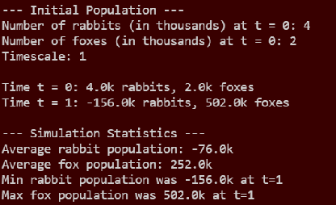

# Rabbit and Fox Population Simulation
 This program will simulate the population of rabbits and foxes over
a specified time, t, after a specified birth and growth rate. This program will also give the average summary
of the rabbit and fox populations, as well as printing out the maximum fox population at that time and the minimum
rabbit population at that time. Program will given an error and terminate if a negative timescale is enter.

The program will also execute an error and terminate If there is a negative input entered for
the birth rate of foxes and death rate of rabbits.

